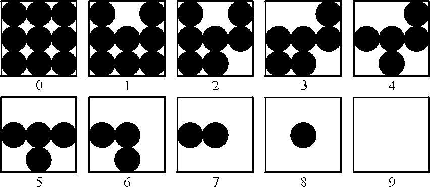
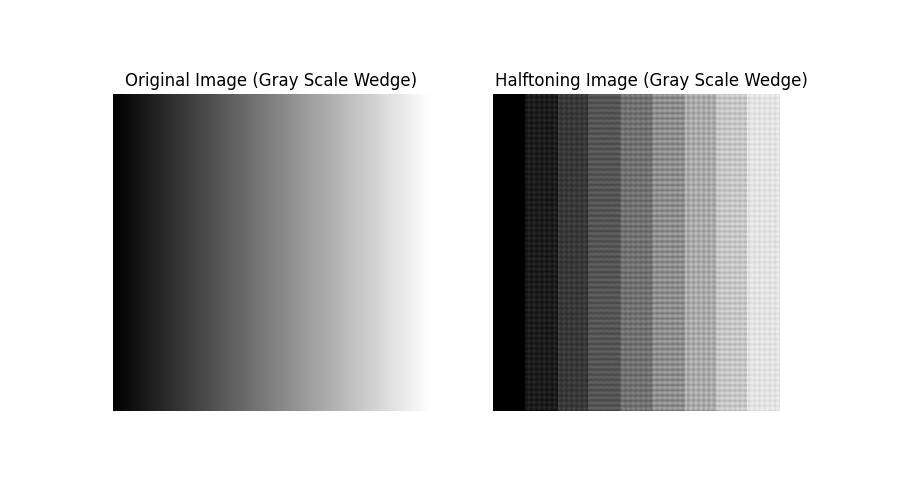
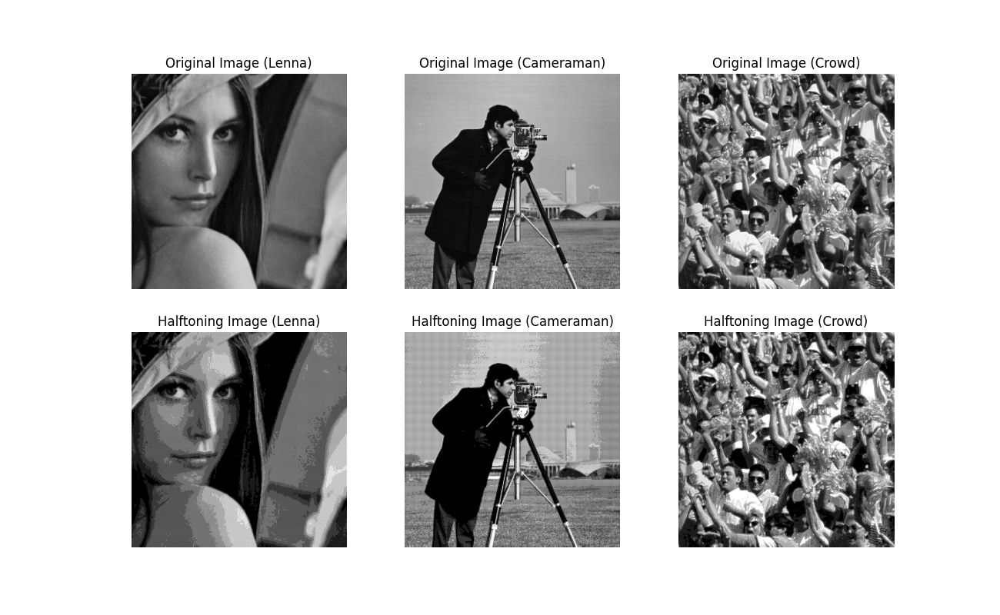

## Project 02-01 &emsp; Image Printing Program Based on Halftoning

> Copyright © 2002 Prentice Hall
> Copyright © 2025 Fu Tszkok

### Question

The following figure shows ten shades of gray approximated by dot patterns. Each gray level is represented by a $3 \times 3$ pattern of black and white dots. A $3 \times 3$ area full of black dots is the approximation to gray-level black, or 0. Similarly, a $3 \times 3$ area of white dots represents gray level 9, or white. The other dot patterns are approximations to gray levels in between these two extremes. A gray-level printing scheme based on dots patterns such as these is called "halftoning." Note that each pixel in an input image will correspond to $3 \times 3$ pixels on the printed image, so spatial resolution will be reduced to 33% of the original in both the vertical and horizontal direction. Size scaling as required in (a) may further reduce resolution, depending on the size of the input image.

(a) Write a halftoning computer program for printing gray-scale images based on the dot patterns just discussed. Your program must be able to scale the size of an input image so that it does not exceed the area available in a sheet of size $8.5 \times 11$ inches ($21.6 \times 27.9$ cm). Your program must also scale the gray levels of the input image to span the full halftoning range.

(b) Write a program to generate a test pattern image consisting of a gray scale wedge of size $256 \times 256$, whose first column is all 0's, the next column is all 1's, and so on, with the last column being 255's. Print this image using your gray-scale printing program.

(c) Print `Lenna_face.bmp`, `cameraman.bmp`and `crowd.bmp` using your gray-scale printing program. Do your results agree with the conclusions arrived at iso perference curve? Explain.

### Method

In this experimental project, we first need to perform scaling on the images. Considering that we will be dealing with image scaling tasks in the subsequent project, we will use only the cv.resize function to achieve image scaling. Since the final goal is to scale the imaging images to a size of $8.5\times11$ inches, we first need to scale the images before processing to a size of $\frac{8.5}{3}\times\frac{11}{3}$ inches. This is because, in halftone image processing, each pixel needs to be enlarged to 3x3 times its original size. To simplify the calculation process, we assume here that the printer's dpi(dots per inch) is 96, which is consistent with the dpi for screen display.

As for the process of halftone image processing, it is relatively simple. We only need to perform layer-by-layer processing on the already scaled images. Specifically, we need to determine which grayscale level each pixel belongs to, and then apply the corresponding halftone matrix to that pixel, thus completing the conversion to a halftone image. By doing this for each pixel, assigning the appropriate grayscale level and halftone matrix, we can obtain the final halftone image.

### Result

First, we conducted an in-depth analysis of the results for question (b). Following the specific requirements of the question, we generated an image with 256 gray levels. After performing halftoning on this image, we could clearly observe that the image was divided into ten distinct gray levels, which fully met the expectations of the question. Upon careful examination of both the continuous tone image and the halftone image, we found that the continuous tone image displayed smooth gradient color changes, whereas the halftone image exhibited noticeable stepwise changes between tones, which visually manifested as a pronounced Mach band effect. Additionally, since each halftone pixel is actually composed of a halftone matrix, the resulting halftone image would exhibit distinct pixelation (or matrixing) characteristics.

Next, we conducted a detailed analysis of the results for question (c). Following the specific requirements of the question, we selected three images — `Lenna_face.bmp`, `cameraman.bmp`, and `crowd.bmp` — for halftoning processing. By comparing the images before and after processing, we observed that in the relatively flat areas of gray levels in the image, after tone reduction processing, false contouring phenomena often occur, which visually appears worse. In fact, this also directly indicates that images with richer details, even with lower gray levels, can still exhibit good visual effects, thereby making the iso perference curve tend to be more vertical.

