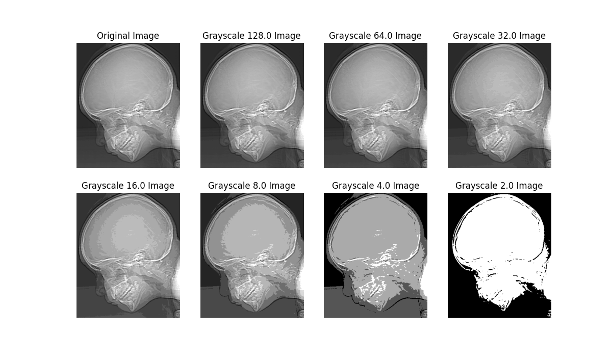

## Project 02-02 &emsp; Reducing the Number of Gray Levels in an Image

### Question

(a) Write a computer program capable of reducing the number of gray levels in a image from 256 to 2, in integer powers of 2. The desired number of gray levels needs to be a variable input to your program.

(b) Download `ctskull-256.bmp` and show the results the program generated.

### Method

In fact, the steps for this experiment are very simple and straightforward, requiring only a basic operation of dividing the grayscale values of the image by two. Specifically, if we explain it in terms of storing each pixel of the image, it means that during each processing step, we discard the least significant bit of the binary number that stores the grayscale value of each pixel. Moreover, in this project, we have not implemented a feature that allows users to specify an input grayscale value. This is because we believe that by adding a simple conditional check, we can directly exit the loop when the image's grayscale level reaches the predefined level and output the processed image.

### Result

Regarding the results obtained from the completed project, it can be observed that as the grayscale levels of the image decrease, the distinction between different grayscale values becomes clearer and more pronounced. Specifically, in areas where the grayscale values are relatively uniform and consistent, as the grayscale level drops, a phenomenon known as the pseudo-contour effect becomes more noticeable. This effect is characterized by the appearance of artificial contour lines in regions that originally had smooth grayscale transitions. These lines do not actually exist in the original image but are a visual illusion caused by the reduction in grayscale levels. Furthermore, this observation aligns with the theoretical concept of the iso perference curve effect discussed earlier in Project 02-01.

