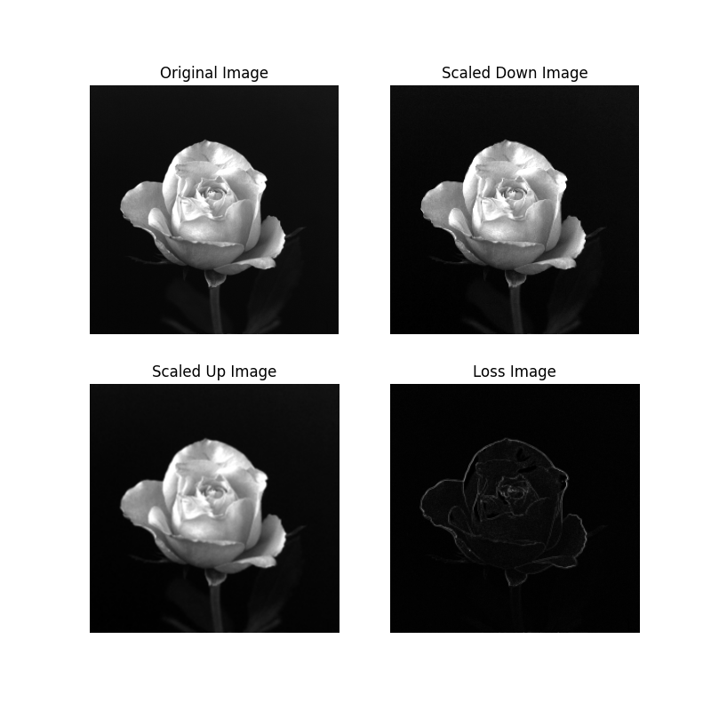

## Project 02-03 &emsp; Zooming and Shrinking Images by Pixel Replication

### Question

(a) Write a computer program capable of zooming and shrinking an image by pixel replication. Assume that the desired zoom/shrink factors are integers. You may ignore aliasing effects. You will need to download `rose1024.bmp`.

(b) Download `rose1024.bmp` and use your program to shrink the image from $1024 \times 1024$ to $256 \times 256$ pixels.

(c) Use your program to zoom the image in (b) back to $1024 \times 1024$. Explain the reasons for their differences.

### Method

In fact, the task of image scaling is accomplished based on the principle of pixel replication, specifically using the nearest-neighbor interpolation method. This method essentially determines the grayscale value of the scaled pixel based on the distance between pixels. However, this approach has certain drawbacks. Since it is based on pixel replication, when the image is enlarged, noticeable distortion occurs. This distortion is particularly evident at the edges of the image, as pixel replication does not handle edge details well, leading to jagged and unnatural effects at the edges. To resolve this issue, the bilinear interpolation method, as mentioned in Project 02-04, should be used to complete the image scaling task.

### Result

During the analysis of the generated results and the comparison with the original input image to generate the loss image, we observed a significant phenomenon: the boundary areas of the image tend to exhibit the most loss. This loss occurs because, at the edge of the image, the grayscale values of the pixels that need to be interpolated are often inaccurately estimated. This misjudgment is caused by the special position of edge pixels, as they do not have enough neighboring pixels to provide accurate reference information. When using the nearest neighbor interpolation algorithm, we found that the average loss is approximately 3.25 grayscale units.

