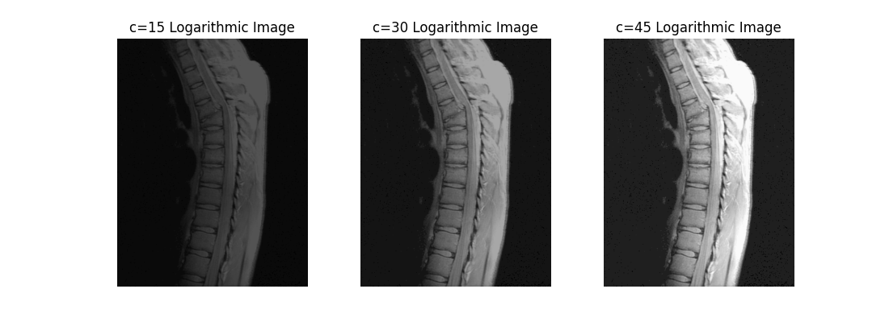

## Project 03-01 &emsp; Image Enhancement Using Intensity Transformations

### Question

The focus of this project is to experiment with intensity transformations to enhance an image. Download `spine.bmp` and enhance it using

(a) The log transformation.

(b) A power-law transformation.

In (a) the only free parameter is c, but in (b) there are two parameters, c and r for which values have to be selected. As in most enhancement tasks, experimentation is a must.

The objective of this project is to obtain the best visual enhancement possible with the methods in (a) and (b). Once (according to your judgment) you have the best visual result for each transformation, explain the reasons for the major differences between them.

### Method

In this project, log transformation and power-law transformation are used to enhance the image. For these two transformations, experiments need to be conducted on their respective results.

Firstly, for the log transformation, the general form of the transformation is:

$$
s = c \log(1 + r)
$$

where $c$ is a constant, and it is assumed that $r \geq 0$. This transformation maps the narrow range of low gray values in the input to a wider range of gray values in the output.

Secondly, for the power-law transformation, the form is:

$$
s = c r ^ \gamma
$$

where $c$ and $\gamma$ are constants. Considering the offset (i.e., a measurable output when the input is 0), the equation is sometimes written as $s = c(r + \varepsilon)^\gamma$. However, the offset is generally a display calibration issue, so it can be ignored here. Similarly, the power-law curve can also map a narrow range of dark input values to a wider range of output values.

### Result

The experimental results demonstrate the effectiveness of intensity transformations in enhancing image details through log and power-law transformations.

For the log transformation, the parameter *c*plays a crucial role in adjusting image contrast. Although the theoretical value of *c*= 105.81 would fully map the log-transformed intensity range [0, 2.41] to the standard grayscale range [0, 255], practical applications prioritize contrast enhancement over complete range mapping. In this experiment, *c*values of 15, 30, and 45 were tested, with *c*= 45 yielding optimal contrast improvement while effectively revealing previously obscured details.

The power-law transformation introduces two adjustable parameters: *gamma*and *c*. The *gamma*parameter governs brightness modulation - lower *gamma*values (<1) produce brighter images by compressing dark tones, while higher values (>1) darken the image by expanding darker regions. Notably, this behavior assumes normalized pixel values; non-normalized data (e.g., [0,255] range) exhibits inverse brightness trends. The *c*parameter functions similarly to its role in log transformation, controlling overall contrast scaling. Experimental observations confirm that combined increases in both *gamma*and *c*enhance contrast, though this effect stems from our non-normalized processing approach. Practically, the configuration of *c*= 10 with *gamma*= 0.6 already achieves satisfactory contrast enhancement while maintaining balanced brightness levels.

