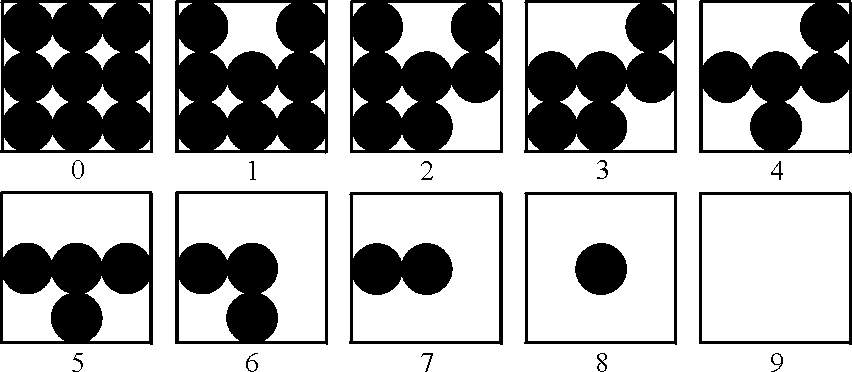
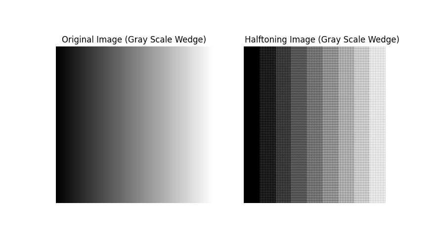
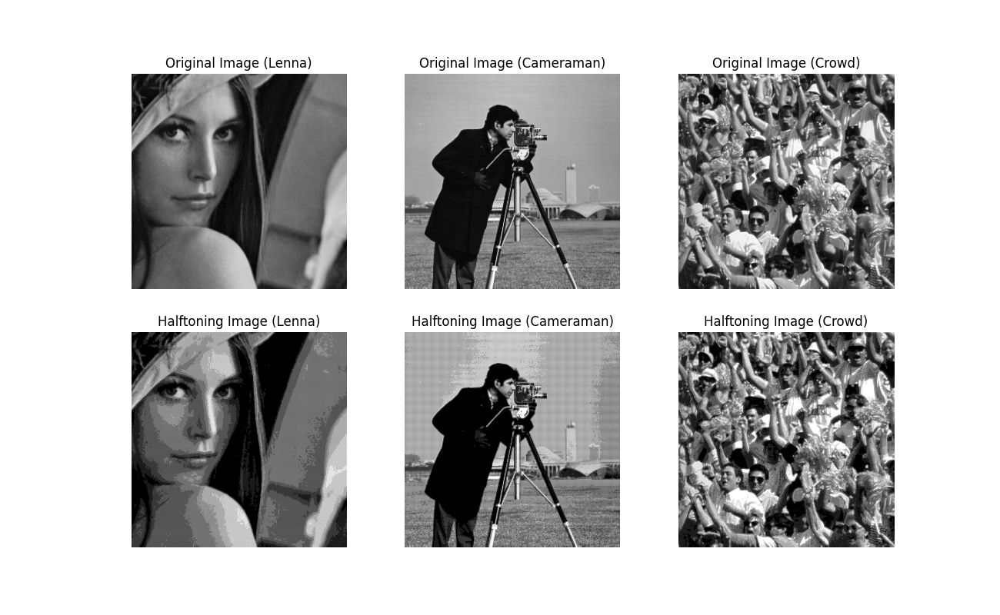

## Project 02-01 &emsp; Image Printing Program Based on Halftoning

> Copyright (C) 2002 Prentice Hall &emsp; Copyright (C) 2025 Fu Tszkok

### Question

The following figure shows ten shades of gray approximated by dot patterns. Each gray level is represented by a $3 \times 3$ pattern of black and white dots. A $3 \times 3$ area full of black dots is the approximation to gray-level black, or 0. Similarly, a $3 \times 3$ area of white dots represents gray level 9, or white. The other dot patterns are approximations to gray levels in between these two extremes. A gray-level printing scheme based on dots patterns such as these is called "halftoning." Note that each pixel in an input image will correspond to $3 \times 3$ pixels on the printed image, so spatial resolution will be reduced to 33% of the original in both the vertical and horizontal direction. Size scaling as required in (a) may further reduce resolution, depending on the size of the input image.

(a) Write a halftoning computer program for printing gray-scale images based on the dot patterns just discussed. Your program must be able to scale the size of an input image so that it does not exceed the area available in a sheet of size $8.5 \times 11$ inches ($21.6 \times 27.9$ cm). Your program must also scale the gray levels of the input image to span the full halftoning range.

(b) Write a program to generate a test pattern image consisting of a gray scale wedge of size $256 \times 256$, whose first column is all 0's, the next column is all 1's, and so on, with the last column being 255's. Print this image using your gray-scale printing program.

(c) Print `Lenna_face.bmp`, `cameraman.bmp`and `crowd.bmp` using your gray-scale printing program. Do your results agree with the conclusions arrived at iso perference curve? Explain.

### Technical Discussion

The core principle of halftoning technology lies in converting continuous grayscale levels into patterns composed of discrete black and white dots of varying sizes or densities. This allows for the visual simulation of grayscale variations on devices capable of printing only black and white dots, thereby enabling the output of grayscale images.

In this program, grayscale simulation is achieved using $3\times3$ black and white dot patterns, which can approximate ten different grayscale levels. Specifically, grayscale level 0 (pure black) is represented by a $3\times3$ dot pattern entirely filled with black dots; conversely, grayscale level 9 (pure white) is represented by a $3\times3$ dot pattern entirely filled with white dots. Intermediate grayscale levels are simulated by adjusting the proportion of black and white dots within the pattern, with a higher number of black dots representing a darker shade of gray. For efficient program access, these predefined $3\times3$ dot patterns are stored in a multi-dimensional array, allowing the program to directly look up and apply the corresponding dot pattern based on the input image's pixel grayscale value. It is important to note that since each pixel of the input image is expanded into a $3\times3$ dot matrix area for printing, the spatial resolution of the final printed image will be reduced to 33% of the original in both vertical and horizontal directions.

This halftoning program incorporates two key functionalities to meet printing requirements: image size adaptation and grayscale level mapping. The image size adaptation function aims to ensure that the output image, after halftoning, can perfectly fit within the standard $8.5\times11$ inch (approximately $21.6\times27.9$ cm) printing paper area. Considering that the halftoning process magnifies the image size three times, the program pre-calculates the maximum allowable dimensions for the original image. If any dimension of the input image exceeds this limit, the program calculates a uniform scaling factor and proportionally reduces the image size to ensure the final halftoned image does not overflow the printing area. This process may, in some cases, further reduce the visual resolution of the image. Grayscale level mapping is a core step in the halftoning process. It is responsible for linearly converting and mapping the 0-255 grayscale values of the input image to the ten discrete grayscale levels supported by the halftoning system, ranging from 0 to 9. This is specifically implemented by dividing the original pixel value by 25.6 and taking the floor. After mapping is complete, the program iterates through each pixel of the original image, selects the corresponding $3\times3$ dot pattern from the predefined dot pattern library based on its mapped grayscale value, and places it into the corresponding position in the output image, ultimately generating a halftoned image three times the size of the original.

### Experiment

First, we generated and processed a $256\times256$ pixel grayscale wedge image as a test. In this image, each column has the same grayscale value, gradually increasing from 0 to 255 from left to right. After this gradient image was processed by the halftoning program and printed, we observed a clear phenomenon of grayscale quantization. The originally smooth and continuous 256 grayscale levels were approximated into 10 discrete grayscale bands, presenting a stepped visual effect rather than a smooth transition. This result visually demonstrates the halftoning technology's quantification and discretization of original grayscale information.

Subsequently, we performed halftoning on three classic grayscale test images: `Lenna_face.bmp`, `cameraman.bmp`, and `crowd.bmp`. These three images possess distinct characteristics in terms of texture and detail richness: `Lenna_face.bmp` contains relatively smooth areas (like human facial skin) and some moderate details (like hair); `cameraman.bmp` is known for its rich details, including high-frequency textures such as grass, buildings, and figures; while `crowd.bmp` contains a large amount of repetitive textures and complex, dense details. Although these images, after halftoning, had their original 256 grayscale levels significantly simplified to only 10 halftoning patterns, we observed that the overall structure and main content of the images remained clearly discernible. When viewed up close, the discrete dot patterns forming the image were clearly visible, but from a certain viewing distance, the human eye integrates these discrete black and white dot patterns into a continuous perception of grayscale.

These experimental results show high consistency with the theoretical conclusions of the **Iso-preference Curve**. Iso-preference curve research indicates that the human eye's perception of image quality is not linear but is significantly influenced by image content and characteristics. A crucial conclusion is that for **detailed images**, the human eye often requires fewer grayscale levels. This is because the inherent, abundant details, textures, and edge information within the image itself can provide sufficient visual cues, allowing the overall visual quality of the image to remain acceptable even with a limited number of grayscale levels. When processing such images, the human eye tends to use this high-frequency spatial information to construct its perception of the image, rather than strictly relying on the precise continuity of grayscale values.
