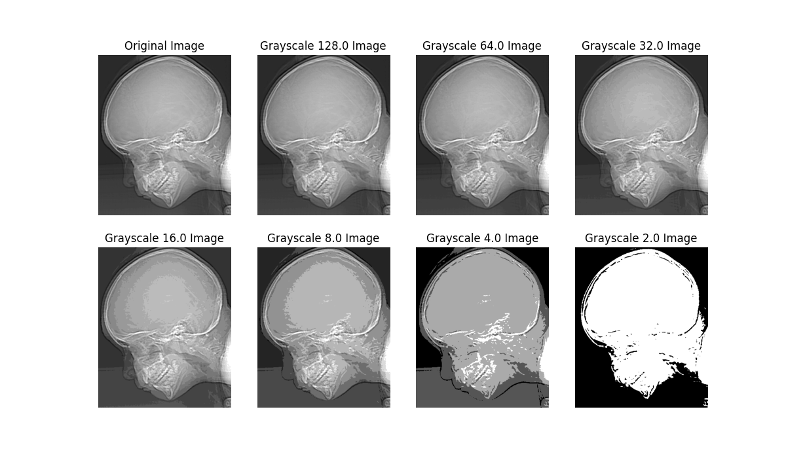

## Project 02-02 &emsp; Reducing the Number of Gray Levels in an Image

> Copyright (C) 2002 Prentice Hall &emsp; Copyright (C) 2025 Fu Tszkok

### Question

(a) Write a computer program capable of reducing the number of gray levels in a image from 256 to 2, in integer powers of 2. The desired number of gray levels needs to be a variable input to your program.

(b) Download `ctskull-256.bmp` and show the results the program generated.

### Technical Discussion

The core principle behind gray level reduction lies in the quantization of the image pixels' grayscale values. For an image with 256 gray levels, each pixel's brightness value can range from 0 to 255. When we need to reduce the number of gray levels, we are essentially decreasing the variety of discrete brightness values that each pixel can represent. This program achieves this by repeatedly performing an integer division by 2 on the current grayscale value of each pixel in the image. Each time this division operation is performed, the number of gray levels that the image can render is halved. For instance, starting from 256 levels, one division will approximate the gray levels to 128 levels; another division will reduce it to 64 levels, and so on, until it ultimately reaches just 2 levels. This operation fundamentally involves dividing the original continuous or finer grayscale range into fewer, equally spaced intervals, and mapping original grayscale values falling within the same interval to a single new grayscale value within that interval. The direct consequence of this quantization process is an irreversible loss of grayscale information, leading to the image appearing more "coarse" visually or exhibiting noticeable false contours, where previously smooth transition areas display unnatural, stepped appearances.

### Experiment

The experiment process begins by loading the original `ctskull-256.bmp` image. This image, a medical CT scan of a skull with 256 grayscale levels, contains extremely rich grayscale details, making it highly suitable for observing the impact of gray level reduction on the image's fine structures and informational representation. After the image is loaded, the program performs a series of seven iterative processing steps, with each iteration halving the number of gray levels in the image. Specifically, the grayscale levels will successively decrease from 256 to 128, then to 64, followed by 32, then 16, subsequently 8, then 4, and finally reaching the minimum of 2 levels. After each gray level reduction operation is completed, the program immediately displays the currently processed image, and explicitly notes the current number of gray levels in the image title. This real-time, stepped presentation allows for a very intuitive and detailed observation of how image quality changes as the number of gray levels decreases.

By observing the series of images generated by the program, we can clearly see the progressive impact of gray level reduction on the image's visual quality. The original 256-level grayscale image exhibits extremely rich details and smooth grayscale transitions, with the fine structures of the skull and subtle differences in tissue density being clearly discernible. When the gray levels are reduced to 128, the overall visual change in the image might not be very significant, but in some previously smooth grayscale transition areas, slight "stepping" or "banding" phenomena may begin to appear, which is the initial manifestation of the quantization effect. As the gray levels are further reduced to 64, more pronounced grayscale layering appears in the smooth areas of the image, and some subtle image details start to blur or disappear. When the gray levels drop to 32, **false contours** begin to appear distinctly in the previously smooth grayscale transition areas of the image. These false contours arise because the grayscale resolution is insufficient, causing continuous grayscale changes to be forcibly mapped to a limited number of discrete grayscale levels, thereby creating unnatural "steps" or "ring-like" edges visually. At this point, the overall contrast of the image might change, detail loss becomes more severe, and the image starts to appear "coarse." Moving to 16 gray levels, the image's grayscale information is significantly simplified, leaving only major grayscale regions, with details almost entirely lost, and the image takes on a distinct cartoonish effect. At 8 and 4 gray levels, the image becomes highly discretized, with only a few major grayscale regions remaining, and details are almost unrecognizable, further degrading image quality. Finally, when the gray levels are reduced to 2, the image fully degrades into a purely black and white image. At this stage, all intermediate grayscale information is completely lost, and the image is composed solely of two extreme brightnesses (black and white), retaining only the most basic contour information and losing all subtle grayscale nuances.

The experimental results clearly reveal that as the number of gray levels in an image continuously decreases, the visual quality of the image undergoes a significant and accelerating decline. The progressive loss of grayscale information leads to blurred details, layering in smooth areas, and the appearance of false contours due to insufficient grayscale resolution, ultimately causing significant distortion throughout the image. This strongly confirms that the grayscale depth of an image is one of the critical factors determining its capacity to carry visual information. For scenarios such as medical imaging, where high-precision grayscale information is required to distinguish subtle tissue structures, maintaining an adequate number of gray levels is particularly crucial for the diagnostic value and accuracy of the image.
