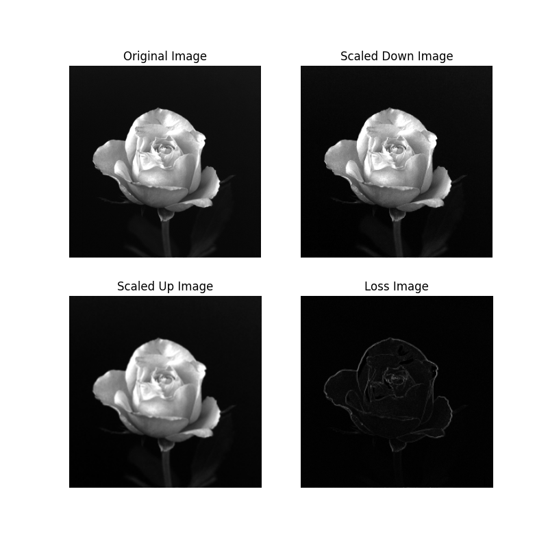

## Project 02-03 &emsp; Zooming and Shrinking Images by Pixel Replication

> Copyright © 2002 Prentice Hall &emsp; Copyright © 2025 Fu Tszkok

### Question

(a) Write a computer program capable of zooming and shrinking an image by pixel replication. Assume that the desired zoom/shrink factors are integers. You may ignore aliasing effects. You will need to download `rose1024.bmp`.

(b) Download `rose1024.bmp` and use your program to shrink the image from $1024 \times 1024$ to $256 \times 256$ pixels.

(c) Use your program to zoom the image in (b) back to $1024 \times 1024$. Explain the reasons for their differences.

### Technical Discussion

The core principle of image scaling, whether enlarging or reducing, is achieved by altering the number and arrangement of pixels in the image. When an image needs to be enlarged, the program increases the number of pixels. This is done by inserting new pixels between the original ones based on the desired scaling factor. The grayscale values of these newly inserted pixels are typically copied directly from their nearest original pixels. For example, if an image is to be enlarged by a factor of two, each original pixel is duplicated four times to form a $2\times2$ block of new pixels, thereby doubling both the width and height of the image. This method is straightforward, but since it involves direct pixel replication, the enlarged image exhibits noticeable "mosaic" or "blocky" artifacts—a form of distortion—particularly along edges and fine details, due to insufficient smoothness in pixel transitions.

Conversely, when an image needs to be reduced, the program decreases the number of pixels. This is typically achieved by selectively removing pixels from the original image. A common implementation is a variant of "nearest-neighbor interpolation," where for each pixel in the target image, the program calculates its corresponding coordinates in the original image and then selects the grayscale value of one or several nearest pixels to assign to the new pixel. In this program’s implementation of reduction, the grayscale values of four adjacent pixels in the original image are averaged, and this average is assigned to the corresponding pixel in the new image. This averaging process can smooth the image to some extent, but when reducing the image significantly, it may lead to loss of detail and blurring—another form of distortion. Whether enlarging or reducing, pixel replication or its variants can degrade image quality. During enlargement, simple replication makes the image appear coarse, with jagged edges. During reduction, the loss of pixel information and averaging can blur fine details.

### Experiment

The experiment began by loading the original `rose1024.bmp` image, a $1024\times1024$ pixel image rich in detail. The program then reduced this image from $1024\times1024$ pixels to $256\times256$ pixels. During reduction, for each pixel in the target image, the program calculated its corresponding position in the original image and averaged the grayscale values of four adjacent pixels, assigning this average to the new pixel. This approach essentially condensed the information from every $4\times4$ pixel block in the original image into a single pixel in the reduced image. Next, the experiment enlarged this $256\times256$ pixel image back to its original size of $1024\times1024$ pixels. During enlargement, the program inserted new pixels between existing ones based on the scaling factor and filled them by replicating the grayscale values of their nearest neighbors.

Comparing the original image, the reduced image, and the re-enlarged image reveals significant differences. The reduced image, though smaller in size, loses some detail due to averaging, resulting in a slightly blurred appearance. When this reduced image is enlarged back to its original dimensions, its visual quality is noticeably inferior to the original. The re-enlarged image exhibits prominent "mosaic" or "blocky" artifacts, with edges no longer smooth and details appearing blurred. This occurs because a substantial amount of original pixel information is permanently discarded during the initial reduction. For example, a $4\times4$ pixel block is averaged into a single pixel, meaning the distinct information from 16 pixels is compressed into a single average value. When this average is later enlarged back into 16 pixels, it can only replicate this average value, failing to restore the rich details and textures originally present in the 16 independent pixels. Thus, the second enlargement merely increases the number of pixels without adding meaningful information, resulting in a "blurry" and "blocky" appearance. Through calculation, the average loss between the original image and the reduced-then-enlarged image is **3.2479963302612305**, measured in grayscale values. This value quantifies the information lost during the reduction and enlargement process.
