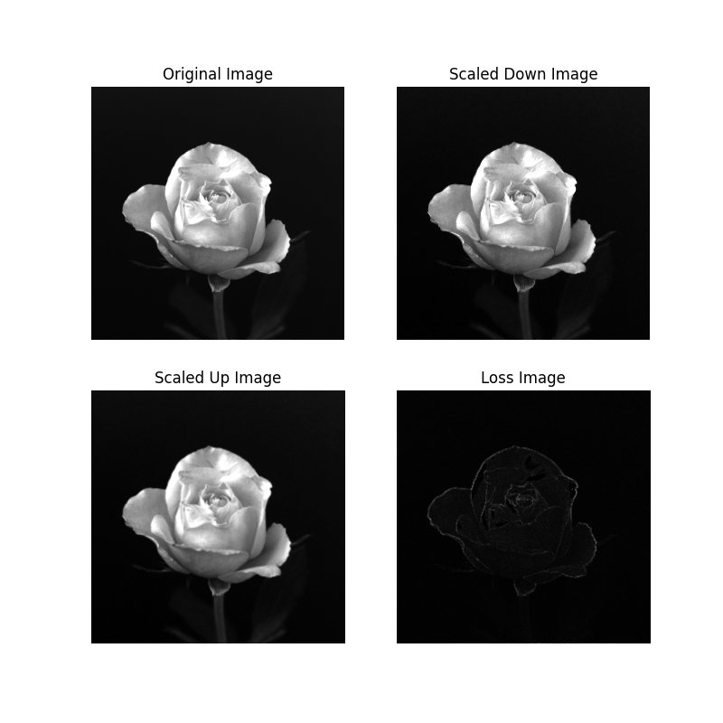

## Project 02-04 &emsp; Zooming and Shrinking Images by Bilinear Interpolation [Multiple Uses]

> Copyright © 2002 Prentice Hall &emsp; Copyright © 2025 Fu Tszkok

### Question

(a) Write a computer program capable of zooming and shrinking an image by bilinear interpolation. The input to your program is the desired size of the resulting image in the horizontal and vertical direction. You may ignore aliasing effects.

(b) Download `rose1024.bmp` and use your program to shrink this image from $1024 \times 1024$ to $256 \times 256$ pixels.

(c) Use your program to zoom the image in (b) back to $1024 \times 1024$. Explain the reasons for their differences.

### Technical Discussion

Bilinear interpolation is a more advanced interpolation technique that takes into account the four nearest original pixels when generating new pixel values. When an image needs to be enlarged or reduced, the program first determines the position of each new pixel in the target image and then inversely maps it to the corresponding floating-point coordinates in the original image. Since these coordinates are generally not integers, they fall within the center of four adjacent pixels in the original image.

The core idea of bilinear interpolation is to use the grayscale values of these four pixels and compute the new pixel's value through two linear interpolations. The formula can be expressed as:

$$
v(x,y)=ax+by+cxy+d
$$

where the four coefficients can be derived from the four positional equations formed by the four nearest neighbors of point $(x, y)$. This method considers the spatial relationships between pixels, creating smoother and more natural transitions, thereby significantly reducing the "mosaic" or "blocky" artifacts that occur during image scaling. Although such artifacts still represent a form of distortion, their severity is much lower compared to simple nearest-neighbor interpolation.

### Experiment

The experiment began by loading the original `rose1024.bmp` image, a $1024\times1024$ pixel image rich in detail. The program then used bilinear interpolation to reduce this image from $1024\times1024$ pixels to $256\times256$ pixels. During reduction, for each pixel in the target image, the program calculated its corresponding position in the original image and performed a weighted average of the four surrounding pixel values to generate the new pixel value. This process effectively condensed the information from every $4\times4$ pixel block in the original image into a single pixel in the reduced image.Next, the experiment enlarged this $256\times256$ pixel image back to its original size of $1024\times1024$ pixels, again using bilinear interpolation.

A comparison of the original image, the reduced image, and the re-enlarged image revealed significant differences. Although bilinear interpolation employs a smoother averaging method during reduction, the irreversible loss of fine details and textures still occurs when merging a $4\times4$ pixel region into a single pixel. When this reduced image was enlarged again, bilinear interpolation created smoother transitions using the existing pixels, making the re-enlarged image appear more natural than one generated by simple pixel replication. However, this interpolation cannot magically restore the original details that were discarded during reduction.

While the re-enlarged image regains its original dimensions, its detail and sharpness remain inferior to the original. This demonstrates that the enlargement process merely increases the number of pixels without adding meaningful information. Consequently, noticeable differences persist between the re-enlarged image and the original.

Through calculation, the average loss between the original image and the reduced-then-enlarged image was found to be **2.769624710083008**, measured in grayscale values. This value quantifies the information lost during the scaling process.
