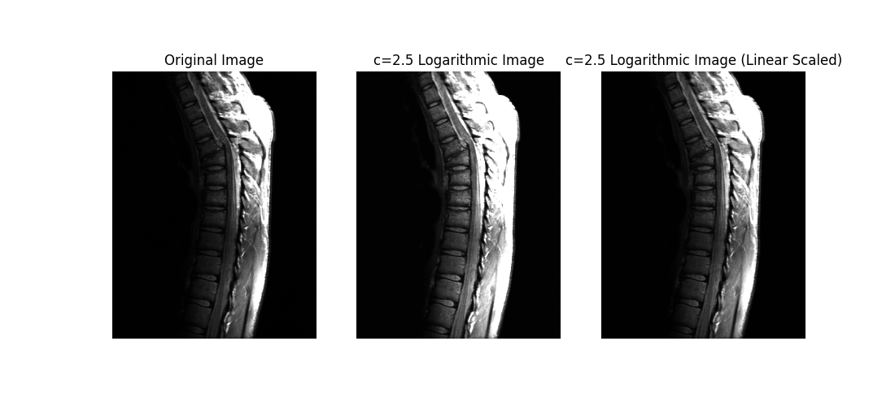
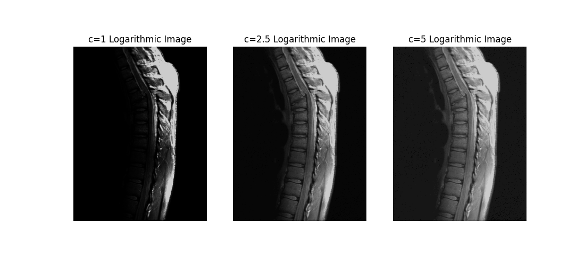
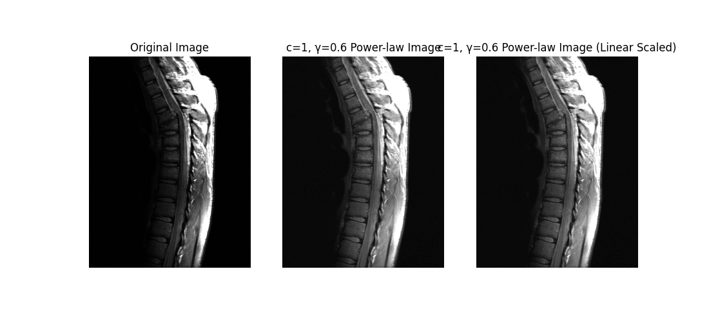
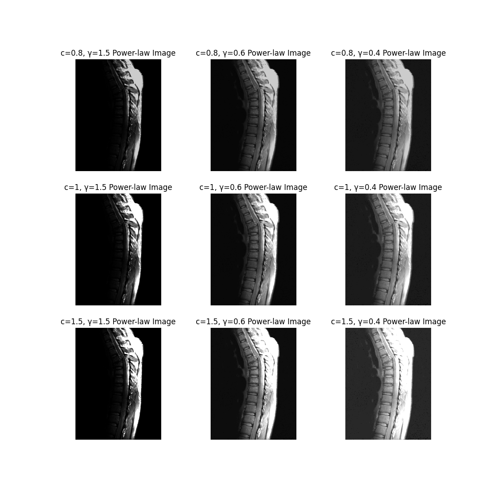

## Project 03-01 &emsp; Image Enhancement Using Intensity Transformations

> Copyright © 2002 Prentice Hall &emsp; Copyright © 2025 Fu Tszkok

### Question

The focus of this project is to experiment with intensity transformations to enhance an image. Download `spine.bmp` and enhance it using

(a) The log transformation.

(b) A power-law transformation.

In (a) the only free parameter is $c$, but in (b) there are two parameters, $c$ and $r$ for which values have to be selected. As in most enhancement tasks, experimentation is a must. The objective of this project is to obtain the best visual enhancement possible with the methods in (a) and (b). Once (according to your judgment) you have the best visual result for each transformation, explain the reasons for the major differences between them.

### Technical Discussion

Intensity transformation is a point processing technique that maps the grayscale value of each pixel in an input image to a new grayscale value in the output image using a predefined function. This transformation is independent of the spatial position of the pixels and depends solely on their grayscale values. This project primarily investigates two important intensity transformation methods: logarithmic transformation and power-law transformation.

**Logarithmic Transformation**, expressed mathematically as:

$$
s=c\log(1+r)
$$

A key characteristic of this transformation is its ability to expand the narrow range of low grayscale values in the input image into a wider range in the output image, while compressing the broader range of high grayscale values. This property makes logarithmic transformation particularly suitable for enhancing images with a narrow grayscale range and overall darkness, such as X-ray images. By applying logarithmic transformation, the contrast in darker regions can be effectively improved, making originally indistinct details clearly visible. The parameter **c** controls the slope of the curve, thereby adjusting the intensity of enhancement.

**Power-Law Transformation**, expressed mathematically as:

$$
s=cr^\gamma
$$

Also known as gamma correction, this transformation offers more flexible control than logarithmic transformation due to its two parameters: $c$ and $\gamma$. The enhancement effect of power-law transformation depends on the value of $\gamma$. When $\gamma<1$, the curve stretches toward higher grayscale values, brightening the darker regions of the image. Conversely, when $\gamma > 1$, the curve compresses toward lower grayscale values, darkening the brighter regions. When $\gamma = 1$, the transformation becomes linear, leaving the image unchanged. Thus, power-law transformation can flexibly adjust the brightness and contrast of an image based on its specific grayscale distribution, enabling targeted enhancement of dark or bright regions.

### Experiment

**Logarithmic Transformation Experiment**

We tested different values of parameter $c$, such as $c=1,2.5,5$. Observations revealed that logarithmic transformation effectively improved the contrast between spinal bones and surrounding tissues in the image. As $c$ increased, the brightness enhancement became more pronounced, making skeletal details in darker regions stand out more clearly. Notably, when $c=1$, if the result was linearly scaled during display, the details in darker regions became significantly more prominent.

**Power-Law Transformation Experiment**

We tested multiple combinations of parameters $c$ and $\gamma$. By adjusting $\gamma$, we observed significant changes in the enhancement effect. When $\gamma<1$, the image brightened, particularly highlighting details in darker regions. For example, with $\gamma=0.6$ or $0.4$, we could clearly see the textures inside and around the spinal bones. Conversely, when $\gamma > 1$, the image darkened overall, which was counterproductive to our goal of enhancing dark-region details. Comparing results under different parameters, we found that selecting a smaller $\gamma$ value (e.g., $\gamma=0.6$ or $0.4$) yielded the best visual enhancement, as it effectively brightened darker regions and made their details clearly visible. Notably, when observing the result with $c=1$ and $\gamma=0.6$, the processing effect on darker regions was excellent, regardless of whether linear scaling was applied.

**Key Differences Between the Two Transformations**

The primary distinction lies in how they adjust the grayscale distribution of the image. Logarithmic transformation is a fixed nonlinear mapping inherently suited for enhancing darker regions, as it effectively expands low grayscale ranges to improve contrast in shadows. However, its enhancement effect is relatively limited, primarily brightening dark areas. In contrast, power-law transformation offers greater flexibility. By adjusting $\gamma$, we can precisely control the focus of enhancement. When $\gamma<1$, it behaves similarly to logarithmic transformation, enhancing darker regions; when $\gamma>1$, it can be used to enhance brighter regions. Thus, power-law transformation provides a broader range of adjustments for different types of images.
