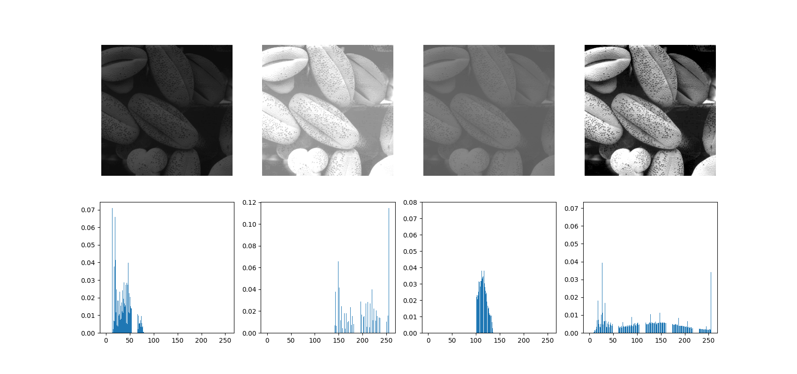

## Project 03-02 &emsp; Histogram Equalization [Multiple Uses]

### Question

(a) Write a computer program for computing the histogram of an image.

(b) Implement the histogram equalization technique discussed in Section 3.3.1.

(c) Download `spine.bmp` and perform histogram equalization on it.

As a minimum, your report should include the original image, a plot of its histogram, a plot of the histogram-equalization transformation function, the enhanced image, and a plot of its histogram. Use this information to explain why the resulting image was enhanced as it was.

### Technical Discussion

An image histogram provides a visual representation of an image's gray-level distribution. By converting gray-level values into a probability distribution, we can more effectively analyze and process the image, for example, by performing contrast stretching. Histogram equalization is one such technique that uses the gray-level histogram to enhance image contrast.

To construct a gray-level histogram for an image, we essentially count the occurrences of each gray-level value across the entire image. Let's say $n_i$ is the number of pixels for a specific gray level $i$ (which typically ranges from 0 to 255 for 8-bit images, but is larger for U16 images). The set of these counts, $\{h(i)|h(i)=n_i\}$, is called the **unnormalized histogram**, where each $h(i)$ is a histogram "bin."

To convert this into a probability distribution, we simply divide each bin count by the total number of pixels in the image, $M \times N$:

$$
p(r_k)=\frac{n_i}{MN}
$$

Histogram equalization is an effective technique for transforming a low-contrast image into a high-contrast one. Low-contrast images typically have histograms concentrated in a narrow range, indicating a limited spread of gray-level values and poor distinction between light and dark areas. In contrast, a high-contrast image has a more uniformly distributed histogram. Thus, histogram equalization improves contrast by stretching the gray-level range.

The core steps of this technique are as follows:

1. Calculate Probability Distribution: First, use the unnormalized histogram to find the probability of each pixel value $p(r_k) = \frac{n_k}{N}$. This is the process of creating a normalized histogram.
2. Find Cumulative Distribution: Next, calculate the cumulative distribution function (CDF), $P(r_k) = \sum^{k}_{i=0}p(r_i) = \sum^{k}_{i=0}\frac{n_i}{N}$.
3. Apply Transformation Function: Use the CDF to create the transformation function, $s_k=T(r_k)=(L-1)\cdot P(r_k)$, where $L$ is the total number of gray levels (e.g., 256 for an 8-bit image).
4. Map and Merge: Finally, round the calculated $s_k$ values to the nearest standard gray level. If multiple original gray levels map to the same rounded value, they are merged.

By following these steps, histogram equalization effectively expands the range of gray levels, which enhances the visual quality of the image.

### Experiment

Based on the image `histogram.png`, the gray-level values are concentrated in the darker regions, which is reflected in the histogram as a cluster of values on the left side. This indicates a low-contrast image. To process it, a histogram was constructed. By comparing the "Histogram (self)" and "Histogram (ravel)" plots, it's clear that their distributions are almost identical. This confirms that the custom histogram calculation method is fully consistent with Python's built-in functions, verifying its correct theoretical implementation.

When comparing the two images processed by the program and OpenCV, their visual effects are highly similar. Both successfully expanded the original image's gray-level values to a wider range, significantly improving contrast. This makes details like the spine much clearer, confirming that the program can effectively perform histogram equalization with performance comparable to the industry-standard OpenCV library. Additionally, the image also shows the gray-level transformation curve. The gentle upward trend of this curve reflects the effective stretching of gray-level values, which is key to successful equalization. Although the "Loss Image" suggests that the two images are not entirely identical, its appearance looks more like the result of added noise. Therefore, it's safe to say that the main equalized images clearly demonstrate the success of the processing.

### Problem & Solution

When processing images with a large number of pixels with a gray-level value of 0, relying solely on the standard histogram equalization process described in textbooks creates a significant problem. As shown in the image, while the contrast is slightly improved, the overall brightness is too high and the gray-level distribution is uneven, resulting in a suboptimal visual appearance.

This contrasts sharply with the results from the OpenCV library. The images processed by OpenCV show a more balanced distribution of light and dark areas, and the effect is much better. The key reason for this difference is that after performing histogram equalization, the OpenCV library also conducts an additional contrast stretch based on the equalization results. This ensures the final image's gray-level values cover the entire $0\sim255$ range. While this process might slightly reduce the number of gray levels, the resulting image enhancement is clearly superior to that of simple equalization.

To solve this issue, the algorithm needs to be optimized. The core idea of the optimization is to add a contrast stretching step after histogram equalization, just like OpenCV does. This re-maps the new gray-level range to $0\sim255$, fully utilizing all available gray levels.

As the results show, the optimized program's output is visually very similar to the results from the OpenCV library. The histograms of both are also nearly identical, displaying a more balanced distribution. This proves that the optimized program not only successfully resolves the original problem but also achieves image enhancement performance comparable to an industry-standard library, allowing it to handle these specific types of images more effectively and achieve better visual results.

