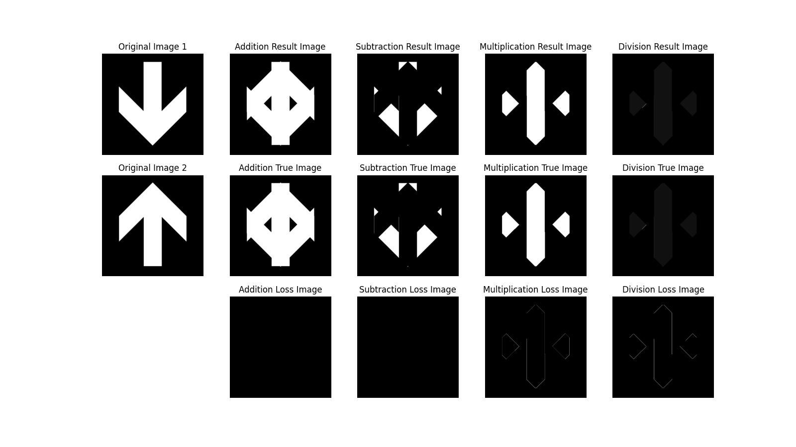

## Project 03-03 &emsp; Arithmetic Operations [Multiple Uses]

> Copyright © 2002 Prentice Hall &emsp; Copyright © 2025 Fu Tszkok

### Question

Write a computer program capable of performing the four arithmetic operations between two images. This project is generic, in the sense that it will be used in other projects to follow. In addition to multiplying two images, your multiplication function must be able to handle multiplication of an image by a constant.

### Technical Discussion

In digital image processing, **image arithmetic operations** are a fundamental and important technique that allows us to synthesize, enhance, or analyze images through pixel-level mathematical operations. This project implements four basic arithmetic operations—addition, subtraction, multiplication, and division—with the core principle of performing calculations on corresponding pixels of two images.

The project's implementation uses the **Numpy** library for matrix operations to ensure efficiency and precision. To avoid **overflow** issues during computation, the code first converts the input **8-bit unsigned integer (uint8)** image data to **64-bit floating-point (float64)**. This type conversion is crucial as it ensures the accuracy of intermediate calculation results. For instance, when two pixel values $I_1(x, y)$ and $I_2(x, y)$ are added and their sum $S(x, y) = I_1(x, y) + I_2(x, y)$ exceeds 255, the `float64` type can store the value accurately, whereas an overflow would occur in a `uint8` type, leading to an incorrect result.

The arithmetic operation functions in this project each have their own unique processing details.

1. **Addition and Subtraction**: Both of these operations involve **clipping** the results to ensure that pixel values are always kept within the valid $[0, 255]$ range. For addition, if $S(x, y) > 255$, $S(x, y)$ is set to 255; for subtraction, if $S(x, y) < 0$, $S(x, y)$ is set to 0. This processing method, known as **saturation arithmetic**, effectively prevents overflow.
2. **Multiplication**: Unlike addition and subtraction, the multiplication function does not clip results that exceed 255 when multiplying two images. Instead, it **normalizes** all results to the $[0, 255]$ range. This is achieved using the following formula
   $$R(x, y) = \lfloor\frac{P(x, y)}{\max(P)}\times 255\rfloor$$
   where $P(x, y) = I_1(x, y) \times I_2(x, y)$ is the original product, $\max(P)$ is the maximum value among all pixel products, and $R(x, y)$ is the normalized result. This normalization helps to preserve the overall contrast of the image.
3. **Division**: The division function specifically addresses the challenge of **division by zero**, which is common in image division. The code uses a conditional check to prevent division-by-zero errors and sets the resulting pixel value to 0 if the denominator is 0.

### Experiment

We found that the images we produced in our experiment were largely consistent with those obtained using OpenCV library functions, which proves that our program is effective. However, the significance of the experiment is not just to prove the program's effectiveness, but to analyze the images and explore why we get these results after performing addition, subtraction, multiplication, and division.

In this experiment, we performed special handling on the pixel values during these operations to prevent the results from exceeding the conventional pixel value range. Specifically, for **addition and subtraction**, we clipped pixel values below 0 to 0 and values above 255 to 255. For **division**, we set pixel values divided by 0 to 0. We did not apply any special handling for **multiplication**. We can see in the multiplication result image that only three contiguous regions are bright. This is because only the pixel values in these regions were not multiplied by 0, so they retained their brightness. The division result image appears to have almost no pixel values. This is because in the division operation, all non-zero pixels become 1 after division, and 1 is not easily distinguishable from 0 within the $0\sim255$ grayscale display range. If we adjust the display range to $0\sim1$, we can see an image similar to the multiplication result.

In the **addition and subtraction** operations, because we clipped out-of-range pixel values to keep them within the [0, 255] range, the results were consistent with the OpenCV library functions, and the **average loss was 0**. The **average loss for multiplication was 0.8197**, which is relatively high. This is because our program did not apply any clipping to multiplication results, whereas the `cv2.multiply` function in OpenCV clips the result by default. Therefore, when the result of multiplying two images is greater than 255, our program retains the original value, while OpenCV clips it to 255. This difference leads to the loss, especially in the **edge regions** of the image. The **average loss for division was 0.0038**, which is very low, indicating that our handling of division by 0 (setting it to 0) is very close to OpenCV's default handling. In conclusion, the **loss** in image processing primarily appears in the **edge regions of the image**. This is because in operations like **convolution** or **image blending**, the pixels in the edge regions are calculated with pixels outside the image. If these external pixels are not properly **boundary handled** (e.g., by padding with 0s or replicating edge pixels), the result will deviate from the standard handling of libraries like OpenCV, leading to a **loss**. This is why the loss in multiplication and division operations is mainly concentrated in the edge areas.

